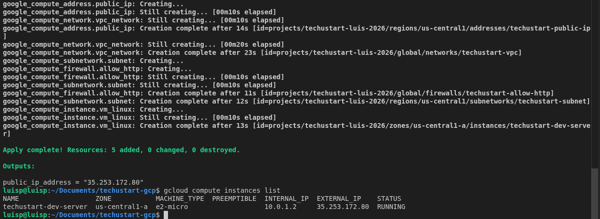
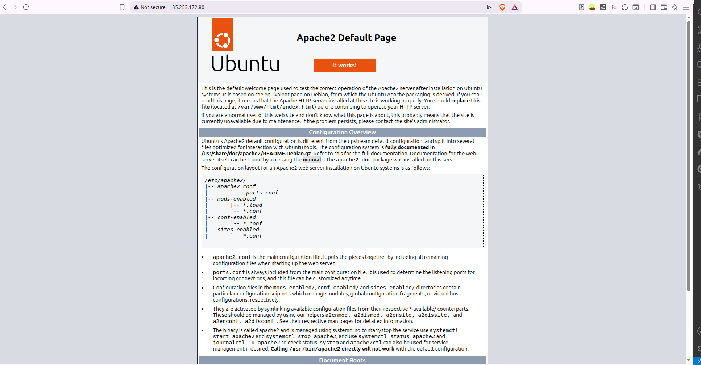

# TechUStart - Infraestructura en GCP con Terraform

Elaborado por Luis Pineda 
## Descripcion

Proyecto Terraform que automatiza la creacion de un servidor de desarrollo Linux en Google Cloud Platform (GCP) con Apache instalado automaticamente. Adaptado desde una arquitectura original en Azure.

Tuve que adaptar a GCP debido a que tuve muchos problemas con ORacle y nunca pude recuperar los creditos de Azure de Estudiente

---

## Estructura del Proyecto

```
techustart-gcp/
├── variables.tf
├── main.tf
└── README.md
```

---

## Adaptaciones realizadas: Azure → GCP

| Concepto | Azure | GCP (este proyecto) |
|---|---|---|
| Proveedor | `hashicorp/azurerm` | `hashicorp/google` |
| Version proveedor | `~> 4.0` o `~> 3.0` | `~> 5.0` |
| Grupo de Recursos | `azurerm_resource_group` | No existe, el proyecto GCP actua como contenedor |
| Red Virtual | `azurerm_virtual_network` | `google_compute_network` |
| Subred | `azurerm_subnet` | `google_compute_subnetwork` |
| IP Publica | `azurerm_public_ip` con `allocation_method = Static` | `google_compute_address` (Static por defecto) |
| Seguridad de Red | `azurerm_network_security_group` asociado a la interfaz | `google_compute_firewall` asociado directo a la VPC |
| Interfaz de Red | `azurerm_network_interface` (recurso separado) | `network_interface {}` dentro de la VM |
| Maquina Virtual | `azurerm_linux_virtual_machine` | `google_compute_instance` |
| Imagen del SO | `publisher/offer/sku` (Canonical/UbuntuServer) | `ubuntu-os-cloud/ubuntu-2204-lts` |
| Script de arranque | `custom_data` codificado en Base64 | `metadata_startup_script` (texto plano) |
| Tamaño de VM | `Standard_B1s` | `e2-micro` |
| Region | `eastus` | `us-central1` |

---

## Variables

Definidas en `variables.tf`:

| Variable | Tipo | Valor por defecto | Descripcion |
|---|---|---|---|
| `gcp_project` | string | **(requerido)** | ID del proyecto en GCP |
| `gcp_region` | string | `us-central1` | Region donde se despliegan los recursos |
| `tipo_instancia` | string | `e2-micro` | Tipo de maquina virtual (capa gratuita) |
| `ssh_public_key_path` | string | `~/.ssh/id_rsa.pub` | Ruta a la llave publica SSH |

---

## Recursos creados

1. **VPC** (`google_compute_network`) — Red virtual privada con subredes manuales
2. **Subred** (`google_compute_subnetwork`) — Rango `10.0.1.0/24` en `us-central1`
3. **IP Publica** (`google_compute_address`) — IP estatica externa asignada a la VM
4. **Firewall** (`google_compute_firewall`) — Permite trafico entrante solo en puerto 80 (HTTP)
5. **VM Linux** (`google_compute_instance`) — Ubuntu 22.04 LTS en zona `us-central1-a`

---

## Automatizacion

Al encenderse la VM ejecuta automaticamente via `metadata_startup_script`:

```bash
sudo apt update && sudo apt install apache2 -y
```

Esto instala el servidor web Apache sin intervencion manual.

---

## Comandos de despliegue

```bash
# 1. Inicializar Terraform y descargar proveedor GCP
terraform init

# 2. Verificar los recursos que se van a crear
terraform plan -var="gcp_project=TU-PROYECTO-ID"

# 3. Desplegar la infraestructura
terraform apply -var="gcp_project=TU-PROYECTO-ID"

# 4. Eliminar todos los recursos al terminar
terraform destroy -var="gcp_project=TU-PROYECTO-ID"
```

> Tambien crear un archivo `terraform.tfvars` (no se sube a git) con el contenido:
> ```
> gcp_project = "TU-PROYECTO-ID"
> ```
> Y ejecutar `terraform apply` sin el flag `-var`.

---

## Output

Al finalizar `terraform apply`, Terraform imprime en terminal la IP publica asignada:

```
Outputs:

public_ip_address = "XX.XX.XX.XX"
```

---

## Evidencia

### terraform apply completado e VM corriendo



### Apache corriendo en el navegador




---

## Requisitos previos

- Terraform instalado (`>= 1.0`)
- Google Cloud SDK instalado y autenticado (`gcloud auth login`)
- Proyecto GCP creado con Compute Engine API habilitada
- Llave SSH generada en `~/.ssh/id_rsa_gcp_techustart.pub`